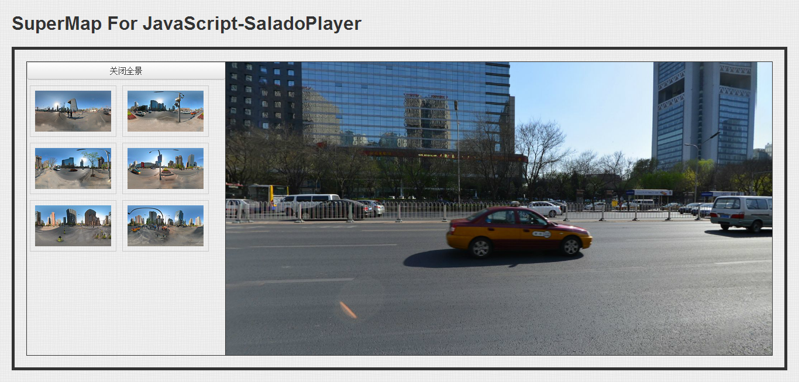

### 一、简介

该工程是SuperMap推出的一个全景制作方案，利用第三方开源软件SaladoPlayer与iClient产品结合为用户提供方便可用的全景制作方案。

全景方案主页地址：http://www.supermapol.com/lab/Panorama/index.html

iClient For JavaScript 全景范例: http://www.supermapol.com/lab/Panorama/JSDemo/index.html

iClient For Flash 全景范例: http://www.supermapol.com/lab/Panorama/FlexDemo/FlexWithSaladoPlayer.html

iClient For Flash3D全景范例: http://www.supermapol.com/lab/Panorama/Flash3DDemo/flash3DViewer.html

SaladoPlayer结合JS地图插件: http://www.supermapol.com/lab/Panorama/SaladoPlayerJSMapPlugin/index.html

iClient For JavaScript综合范例: http://www.supermapol.com/lab/Panorama/JSComDemo/index.html

iClient For Flash3D综合范例: http://www.supermapol.com/lab/Panorama/Flash3DComDemo/flash3DViewer.html

### 二、总结

总的来看，我们需要下面几步：

1. 创建2:1全景图片

2. 用SaladoConverter切割图片

3. 将切割好的图片资源文件夹放入scenes文件夹下

4. 运行"批量生成SaladoPlayer配置文件工具"，按照我们的要求进行设置并生成

5. 运行范例程序展示

6. 根据需要扩展和开发范例

### 三、注意

SuperMap for JavaScript和 SuperMap for Flash3D、SuperMap for Flash提供了完整的制作方案， 但是需要注意以下几点：

1.这里使用的全景制作软件全部都是免费开源的，其目的是为了节省开发人员的成本，以便让刚开始接触全景的人不至于承担太大的经济压力。

2.在数据制作部分，通过开源软件拼接好的全景图有一个要求，就是长与宽的比为2:1，这是因为垂直180°，水平360°的原因造成的，如果不是这个比例SaladoConverter是无法进行图片的切割的。

3.由于整个制作方案中使用的都是开源软件，所以用户是可以获取到源代码的，用户可以通过修改源代码来达到项目要求。

4.另外需要说明的是，开源软件可以免费用，但是由于其中大部分开源软件是遵照GPL协议，所以用来做项目开发是没有问题的，但如果想要用其软件作为二次开发的基础来进行商业运作则你开发出来的产品同样要开源并遵照GPL协议。

5.另外除了使用开源软件进行图像的拼接以外，还可以使用PTGui这个拼图工具进行拼接，该工具操作更加简单与高效。

6.在修图方面，如果你对PhotoShop熟悉一些的话，使用PhotoShop能够让你的全景图更上一个档次。

### 四、许可授权

详见“LICENSE.txt”。

### 五、效果展示

下面是具体的效果

